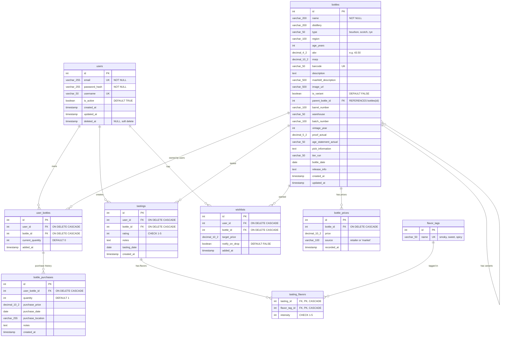

# My Cask Database Entity Relationship Diagram

```mermaid
erDiagram
    users ||--o{ user_bottles : "owns"
    users ||--o{ tastings : "creates"
    users ||--o{ wishlists : "has"

    bottles ||--o{ user_bottles : "owned by users"
    bottles ||--o{ tastings : "tasted"
    bottles ||--o{ bottle_prices : "has prices"
    bottles ||--o{ wishlists : "wanted"
    bottles ||--o{ bottles : "has variants"

    user_bottles ||--o{ bottle_purchases : "purchase history"

    tastings ||--o{ tasting_flavors : "has flavors"
    flavor_tags ||--o{ tasting_flavors : "tagged in"

    users {
        int id PK
        varchar_255 email UK "NOT NULL"
        varchar_255 password_hash "NOT NULL"
        varchar_50 username UK
        boolean is_active "DEFAULT TRUE"
        timestamp created_at
        timestamp updated_at
        timestamp deleted_at "NULL, soft delete"
    }

    bottles {
        int id PK
        varchar_200 name "NOT NULL"
        varchar_200 distillery
        varchar_50 type "bourbon, scotch, rye"
        varchar_100 region
        int age_years
        decimal_4_2 abv "e.g. 43.50"
        decimal_10_2 msrp
        varchar_50 barcode UK
        text description
        varchar_500 mashbill_description
        varchar_500 image_url
        boolean is_variant "DEFAULT FALSE"
        int parent_bottle_id FK "REFERENCES bottles(id)"
        varchar_100 barrel_number
        varchar_50 warehouse
        varchar_100 batch_number
        int vintage_year
        decimal_5_2 proof_actual
        varchar_50 age_statement_actual
        text pick_information
        varchar_50 tier_run
        date bottle_date
        text release_info
        timestamp created_at
        timestamp updated_at
    }

    user_bottles {
        int id PK
        int user_id FK "ON DELETE CASCADE"
        int bottle_id FK "ON DELETE CASCADE"
        int current_quantity "DEFAULT 0"
        timestamp added_at
    }

    bottle_purchases {
        int id PK
        int user_bottle_id FK "ON DELETE CASCADE"
        int quantity "DEFAULT 1"
        decimal_10_2 purchase_price
        date purchase_date
        varchar_255 purchase_location
        text notes
        timestamp created_at
    }

    tastings {
        int id PK
        int user_id FK "ON DELETE CASCADE"
        int bottle_id FK "ON DELETE CASCADE"
        int rating "CHECK 1-5"
        text notes
        date tasting_date
        timestamp created_at
    }

    flavor_tags {
        int id PK
        varchar_50 name UK "smoky, sweet, spicy"
    }

    tasting_flavors {
        int tasting_id "FK, PK, CASCADE"
        int flavor_tag_id "FK, PK, CASCADE"
        int intensity "CHECK 1-5"
    }

    bottle_prices {
        int id PK
        int bottle_id FK "ON DELETE CASCADE"
        decimal_10_2 price
        varchar_100 source "retailer or 'market'"
        timestamp recorded_at
    }

    wishlists {
        int id PK
        int user_id FK "ON DELETE CASCADE"
        int bottle_id FK "ON DELETE CASCADE"
        decimal_10_2 target_price
        boolean notify_on_drop "DEFAULT FALSE"
        timestamp added_at
    }
```
